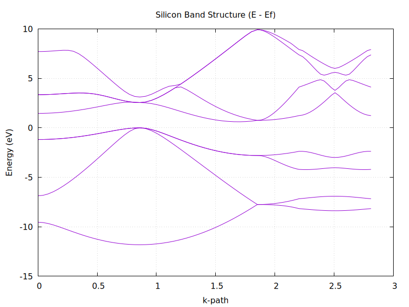
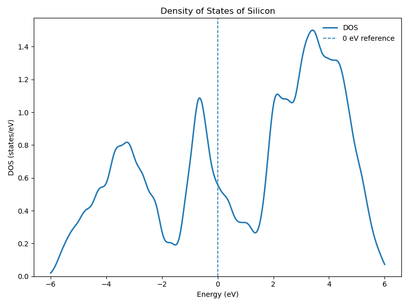
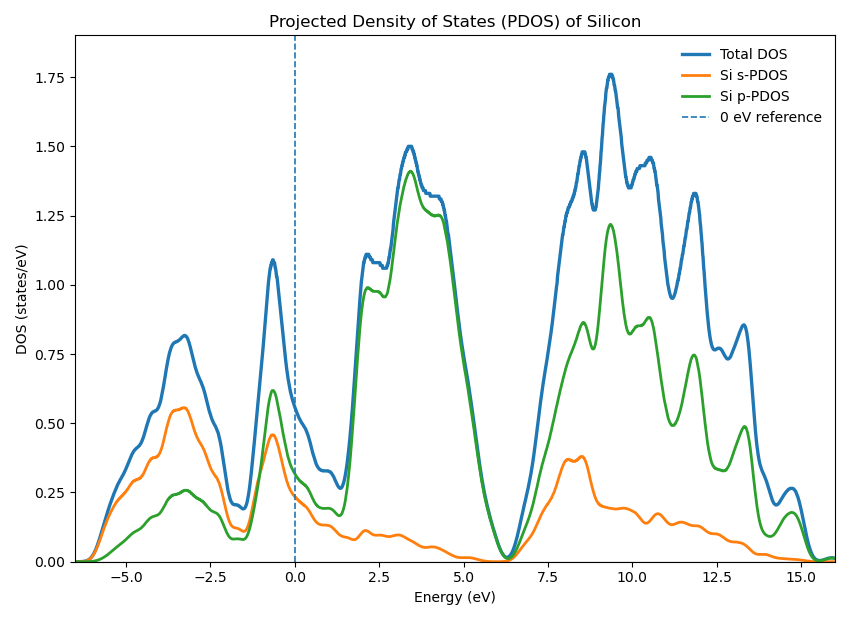
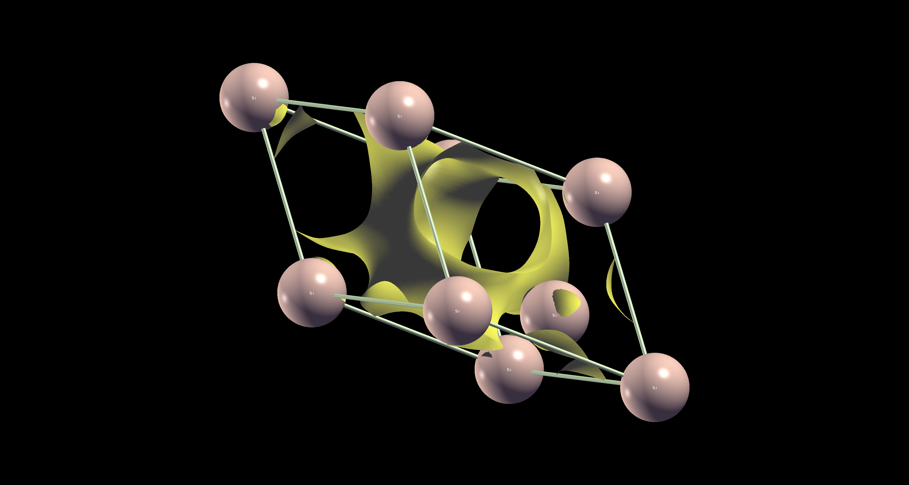
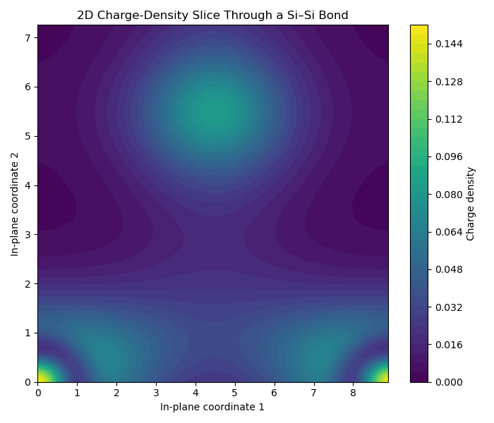

# Silicon Electronic Structure using DFT (Quantum ESPRESSO, PBE)

## Objective

Perform a complete Density Functional Theory (DFT) workflow for bulk silicon to:

- obtain the electronic ground state
- optimize the crystal structure
- compute band structure and density of states (DOS)
- extract and interpret the band gap
- analyze orbital contributions via PDOS
- investigate bonding using charge density

---

## Methodology

### 1. SCF (Self-Consistent Field)

Solved the Kohn–Sham equations:

Ĥ ψ_i = ε_i ψ_i

Result:
- Converged electron density ρ(r)
- Total energy: **−93.45138 Ry**

---

### 2. Structural Optimization (vc-relax)

Minimized total energy with respect to atomic positions and cell:

F_i = −∂E/∂R_i  
σ = ∂E/∂cell  

Result:
- Lattice parameter ≈ **5.47 Å**
- Negligible forces and stress

---

### 3. Band Structure

Computed E(k) along high-symmetry path:

L → Γ → X → W → K

Concepts:
- Bloch theorem
- Brillouin zone sampling

---

### 4. Band Gap

Eg = E_CBM − E_VBM

Results:
- VBM ≈ 0 eV (Γ)
- CBM ≈ 0.609 eV (Γ–X)
- **Eg ≈ 0.61 eV (indirect)**

---

### 5. Density of States (DOS)

Computed using NSCF + `dos.x`.

Observations:
- Valence band: populated states below 0 eV
- Band gap: D(E) ≈ 0 region
- Conduction band: states above ~0.6 eV

Result:
- DOS confirms **Eg ≈ 0.6 eV**

---

### 6. Projected Density of States (PDOS)

Computed using `projwfc.x`.

Key findings:

- Lower valence region → stronger **s-character**
- Upper valence + conduction → dominant **p-character**
- Significant orbital mixing across energy range

Löwdin charges per Si atom:
- total ≈ 3.96
- s ≈ 1.17
- p ≈ 2.79

Spilling parameter:
- **0.009 

Interpretation:
- Electronic states are hybridized
- Consistent with **sp³ bonding**

---

### 7. Charge Density & Bonding Analysis

#### 3D Isosurface (XCrySDen)

- Charge density forms continuous, non-spherical regions
- Density extends between neighboring atoms

#### 2D Slice (Bond Plane)

- Plane passes through Si–Si bond
- Shows continuous charge density between atoms

Interpretation:
- electrons are shared between atoms
- bonding is **directional and covalent**

---

## Results

### Band Structure

*Figure: Electronic band structure of silicon along the high-symmetry path L → Γ → X → W → K. The valence band maximum occurs at Γ, while the conduction band minimum lies along Γ–X, confirming an indirect band gap of ~0.61 eV.*

---

### Density of States (DOS)

*Figure: Total density of states (DOS) of silicon. A clear energy region with zero states is observed between the valence and conduction bands, confirming a band gap of ~0.6 eV consistent with the band structure.*
---

### Projected Density of States (PDOS)

*Figure: Projected density of states showing s and p orbital contributions. The lower valence region contains stronger s character, while the upper valence and conduction regions are dominated by p states, indicating sp³ hybridization.*

---

### Charge Density (3D Isosurface)

*Figure: Isosurface of the total charge density of silicon. The continuous electron density between neighboring atoms indicates shared electrons and directional covalent bonding in the diamond cubic structure.*

---

### Charge Density (2D Slice)

*Figure: Two-dimensional slice of the charge density through a Si–Si bond. The continuous electron density between atoms forms a charge bridge, providing direct real-space evidence of covalent bonding and sp³ hybridization.*

---

## Physical Interpretation

- Silicon is an **indirect band gap semiconductor**
- PBE underestimates the experimental band gap (~1.1 eV)
- PDOS reveals **s–p hybridization**
- Charge density confirms **directional covalent bonding**

Combined analysis:

> Energy-space (PDOS) + real-space (charge density) → consistent sp³ hybridization picture

---

## Project Structure
inputs/ → QE input files
outputs/ → raw outputs
pseudo/ → pseudopotentials
results/ → plots and figures
notes/ → detailed methodology notes
scripts/ → plotting scripts
---

---

## Tools Used

- Quantum ESPRESSO (pw.x, bands.x, dos.x, projwfc.x, pp.x)
- Python (NumPy, Matplotlib)
- XCrySDen (visualization)
- Bash utilities

---

## Key Learnings

- SCF convergence and numerical stability
- Structural optimization using BFGS
- k-point sampling in reciprocal space
- Interpretation of band structure and DOS
- Orbital-resolved analysis via PDOS
- Real-space bonding analysis via charge density

---

## Limitations

- PBE underestimates band gap
- PDOS depends on projection basis
- Charge density is total (not difference density)

---

**Md. Saidul Islam**  
